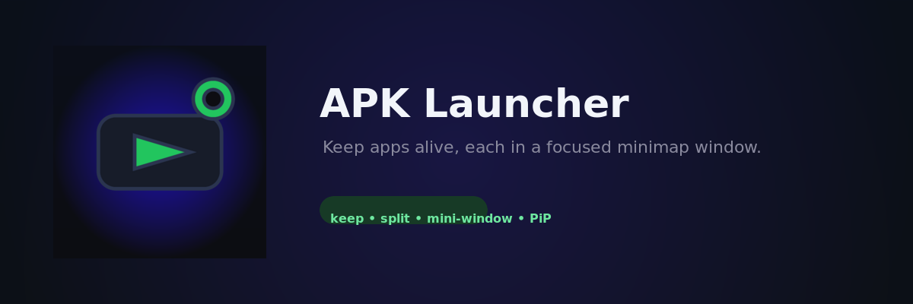

# APK Launcher

<p align="center">
  
</p>

Нативный (без WebView и HTML) Android-лаунчер: список установленных
приложений, запуск одной кнопкой и **keep-alive**: выбранные приложения
держатся живыми foreground-сервисом, который перезапускает процесс, если он
умирает.

## Возможности

- Полностью нативный UI `MainActivity`: поиск, сетка карточек с иконками и
  версиями, запуск по тапу.
- Тумблер keep-alive на каждой карточке и в списке процессов. Держимые
  приложения не выскакивают поверх лаунчера: пока лаунчер на экране с фокусом,
  авто-подъём не срабатывает, а приложение, которое вы закрыли, не
  «воскрешается» мгновенно (кулдаун и авто-отказ после повторных закрытий).
- Панель живых процессов с keep/запустить прямо из списка.
- Foreground-сервис с частичным wake lock и ватчдогом (проверка каждые 2 с).
- **Мультиоконность**: кнопка «окно» на каждой карточке/процессе открывает
  приложение в соседнем окне (split-screen), «сплит» — открывает все приложения
  из keep в отдельных окнах разом; лаунчер при этом остаётся в другой половине
  экрана (`resumeWhilePausing`).
- **Мини-окна (PiP-подобно)**: тумблер «пин» держит приложение в уменьшенном
  свободном окне (launch bounds) — фокус не теряется и фон его не убивает;
  «мини» открывает приложение сразу маленьким окном, watchdog поднимает
  «пялированные» тоже в мини-окно.
- **PiP для лаунчера**: кнопка «PiP» сворачивает сам лаунчер в плавающее окно —
  keep-alive и автообновление продолжают работать, пока поверх другие окна.
- Панель обновлений: приложение сверяет версию с GitHub Releases и предлагает
  установить новую.
- Автономное обновление ключа версии: `versionName` берётся из последнего git-тега,
  `versionCode` — из числа коммитов.

## Структура

- `android/` — весь код на Kotlin: нативный UI, `AppKeeper`, `KeepAliveService`,
  `Updater`. Веб-части нет.
- `android/keystore/` — встроенный (embedded) release-ключ для подписи сборки.
- `docs/` — обложка репозитория.

## Сборка

```
cd android
./gradlew :app:assembleDebug    # debug (нужен SDK, адрес в local.properties)
./gradlew :app:assembleRelease  # подписанный release своим embedded-ключом
```

Release собирается с версией из текущего тега (`git describe`) и подписывается
встроенным keystore (`keystore.properties`), поэтому любой клон репозитория
воспроизводит release-сборку одинаково.

## Как выкатить release

```
git tag v1.0.1            # версия подхватится автоматически
git push origin main --tags
```

`Updater` в приложении увидит новый тег с релизом и предложит обновиться.

## Что делает приложение

- `MainActivity` — поиск, сетка карточек, тумблер keep/pin, панель процессов,
  мультиоконный и мини-оконный запуск, PiP лаунчера, автообновление каждые
  2.5 с, проверка обновлений при запуске.
- `AppKeeper` — хранит списки «держимых» и «пинованных» пакетов в
  SharedPreferences и синхронизирует foreground-сервис.
- `KeepAliveService` — ватчдог на wake lock: каждые 2 с проверяет
  `runningAppProcesses` и поднимает умерший процесс заново (пинованные — сразу
  в мини-окно); восстанавливает списки после перезапуска системой.
- `Updater` — запрашивает `releases/latest` с GitHub и показывает панель
  обновления, если найдена более новая версия.

## Ограничения Android (workarounds)

- Нужен `QUERY_ALL_PACKAGES` для полного списка приложений.
- На Android 10+ фоновый запуск сервисами ограничен, поэтому обёртка использует
  foreground-сервис типа `specialUse` с удержанием wake lock — полноценная
  борьба с фоном всё равно возможна только при видимом уведомлении.
- На Android 13+ запрашивается разрешение `POST_NOTIFICATIONS`.
- Мини-окна (`setLaunchBounds`) раскрываются в свободное окно на системах с
  поддержкой freeform (планшеты, десктоп-режим, Android 15+ с несколькими
  окнами); на обычных телефонах они мягко сводятся к обычному запуску, а
  стабильный удержанный фокус даёт PiP-режим лаунчера.